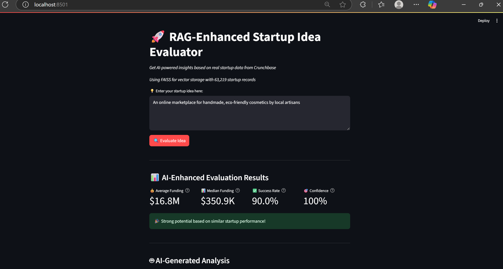

# 🚀 RAG-Enhanced Startup Idea Evaluator 

## 🛠️ Tech Stack

| Layer       | Tech Used                                                                 |
|-------------|---------------------------------------------------------------------------|
| 🧠 **LLM**       | `Phi-2` (local), via `transformers` 🤖                                    |
| 🧬 **Embeddings**| `sentence-transformers` (`all-MiniLM-L6-v2`) + `FAISS` / `Chroma` fallback |
| 📈 **Trends**     | `pytrends` for Google Trends momentum analysis                        |
| 📂 **Data**       | `Crunchbase CSV`, `pandas` for funding & success stats                |
| 🎨 **UI**         | `Streamlit` with caching, dark mode & interactive widgets             |

> **Get AI‑powered insights** on your startup idea, grounded in **real Crunchbase data** and **Google Trends**, with a local LLM + RAG pipeline.

---

## ✨ Features

- **🔍 Keyword Extraction** via Phi‑2 LLM with few‑shot examples & fallback  
- **📈 Trend Analysis** using Google Trends data  
- **🤖 Semantic Matching** of keywords to Crunchbase categories (sentence‑transformers)  
- **🔄 Retrieval‑Augmented Generation (RAG)** with FAISS/Chroma and local embeddings  
- **📊 Data‑Driven Metrics**: average & median funding, success rate, confidence  
- **🎨 Streamlit UI**: smooth dark‑mode interface with metrics, expanders, and analysis  

---

## 🧠 How It Works – A Smart Pipeline from Idea to Insight

This project takes a **one-line startup idea** and evaluates its market potential using a multi-step, AI-powered pipeline:

1. 💡 **Input**: User enters a short startup idea (e.g. “A mobile app for sustainable fashion”)
2. 🔍 **LLM Keyword Extraction**: A local `Phi-2` model extracts meaningful keywords using few-shot examples
3. 📈 **Trend Analysis**: Keywords are sent to Google Trends to retrieve 12-month popularity scores
4. 🧬 **Semantic Category Matching**: The system finds relevant Crunchbase categories using sentence embeddings and semantic similarity
5. 📊 **Data Evaluation**: It calculates category-wise metrics like average funding, median funding, number of funding rounds, and estimated success rate
6. 📚 **RAG Document Retrieval**: A vector store is used to find similar startup descriptions or relevant documents from Crunchbase using FAISS/Chroma
7. 🤖 **AI-Generated Insight**: The local LLM (Phi-2) uses the retrieved data to generate a **natural-language explanation** summarizing the potential, trends, and relevance of the idea
8. ✅ **Interactive Dashboard**: All this is displayed in an elegant Streamlit app, showing scores, matched startups, AI insights, and more

⚡ The entire pipeline is built to run **locally**, with **no API keys**, using open-source LLMs and embeddings — making it lightweight, private, and deployable.

---

## 📸 Screenshots

### 1️⃣ Enter Your Idea, Evaluate & See Key Metrics

### 2️⃣ AI‑Generated Analysis  

### 3️⃣ Dive into Similar Startups  

### 4️⃣ Basic Analysis Details  

---
